# BREADCRUMBS — System Map (features + data flow)

**Purpose.** One coherent picture of *what the product does* and *how data moves through it*, so the
pitch/slide work and the code/script work stay consistent with each other and with the backend the
**ralph loop** is building. This is the **connective map** — not a competing spec.

**Authority (read the source, not a paraphrase, when it matters):**
- `PRD.JSON` — authoritative for **what** gets built (milestones M0–M8 + their verifications + hard_rules).
- `bridge/CONTRACT.md` — authoritative for the **interface** between backend and frontend (field names, JSON shapes, provenance class). *(Written by the loop at milestone M4; may not exist yet.)*
- `docs/premise.md` — authoritative for **why** (the locked product premise + 90-sec demo).
- `docs/branching.md` — authoritative for **who touches what**.
- This file — the **map that ties them together**. If it ever disagrees with the four above, they win; fix this file.

**Build status (as of this writing):** backend is a **scaffold with stubs only — the ralph loop has not
been fired yet**, so `agent/ sim/ db/ bridge/` are largely empty. What is real *today* is the cached data
in `globe/assets/` and the two consoles (`globe/food3d.html`, `globe/food.html`). See
[§9 Current state](#9-current-state-and-open-items).

---

## Reader routing — subsequent agents start here

Don't read top to bottom unless you're onboarding. Jump to your lane:

| If you are… | Read these sections |
|---|---|
| **Writing the pitch / demo script / slides** | [§5 Narrative and demo beats](#5-narrative-and-demo-beats) → [§6 Real vs modeled](#6-real-vs-modeled) → [§7 Why it must be local](#7-why-it-must-be-local) → [§2 Features](#2-features) |
| **Writing or extending backend code** (with or alongside the ralph loop) | [§3 Data flow](#3-data-flow-end-to-end) → [§4 The agent swarm](#4-the-agent-swarm) → [§8 Branches and adding features](#8-branches-and-adding-features) |
| **Building the UI / console** | [§3.1 The bridge](#31-the-bridge-the-only-seam) → [§2 Features](#2-features) → [§5 Narrative and demo beats](#5-narrative-and-demo-beats) |
| **Making assets / logo / graphics** | [§2 Features](#2-features) → [§5 Narrative and demo beats](#5-narrative-and-demo-beats) → [§6 Real vs modeled](#6-real-vs-modeled) |

---

## 1. The system in one breath

An always-on, **on-prem** food-safety agent for a NYC food operator. It watches the live FDA recall feed,
knows the operator's suppliers and locations, and the instant a recall lands it answers three questions in
seconds — **am I hit, how bad, what do I do** — reasoning entirely on an NVIDIA **GB10** box, data never
leaving the building.

The spine is one straight line: **real cached data → MongoDB → a 5-agent swarm that calls Mongo
aggregations as tools → a JSON bridge → a 3D console.** Everything runs locally; the network can be
unplugged at demo time.

---

## 2. Features

What a viewer actually sees. Each feature names the agent/data behind it and whether it's **REAL** or **MODELED**
(this labeling is load-bearing — see [§6](#6-real-vs-modeled)).

| # | Feature | Behind it | Class |
|---|---|---|---|
| **F1** | **Idle watch** — 3D NYC, the operator's ~12 sites lit among the city; sentinel "● watching · local"; supplier scorecard visible (Baldor clean, Dole/Fresh Express/Sysco hot). | Console + `operator_sites` + `distributors` | sites MODELED / scorecard REAL |
| **F2** | **Recall drops** — a real openFDA item hits the feed; the Watcher wakes. | Mongo **change stream** → Watcher | REAL |
| **F3** | **Trace exposure** — "3 of your 12 sites source this" — exposed sites light red on their real blocks. | Tracer → `exposure` aggregation | links MODELED / sites REAL |
| **F4** | **Compounding risk** — "2 of those already carry critical food-handling violations." | Risk → `compounding` aggregation + distributor `class1` | REAL |
| **F5** | **Brief** — plain-language ops brief + a defensible swap recommendation ("swap Dole → Baldor, 0 recalls vs 205"). | Briefer (local LLM) over the Response | REAL numbers, LLM prose |
| **F6** | **Act** — an SMS to affected site managers, drafted + fired to a mock phone on stage. | Comms → mock phone UI (offline) | action REAL, transport mocked |
| **F7** | **GB10 telemetry HUD** — tokens/sec, unified-memory GB of 128, SoC watts, N agents concurrent. | NVML/tegrastats on box | REAL on-box |
| **F8** | **Honesty layer** — every modeled element is visibly labeled; a `UNCLASSIFIED // SIMULATION` banner. | UI convention | — |

The **hero moment** is F2→F6 as one continuous reactive flow. The scorecard (F1) is ambient backdrop, not the lead.

---

## 3. Data flow, end to end

```mermaid
flowchart LR
  subgraph SRC["Real sources · fetched once"]
    A1["openFDA recalls"]
    A2["DOHMH inspections"]
    A3["distributor recall history"]
    A4["NYC buildings · LiDAR"]
  end
  SRC -->|"scripts/fetch_*.py"| CACHE[("globe/assets/*.json<br/>cached · offline")]
  CACHE -->|"scripts/load_mongo.py"| MONGO[("MongoDB<br/>recalls · establishments · distributors<br/>operator_sites · buildings_meta<br/>+ 2dsphere geo index")]
  MONGO -->|"db/queries.py aggregations"| SIM["sim/respond.py<br/>→ Response object"]
  MONGO -.->|"change stream = the Watcher"| SWARM
  SIM --> SWARM["agent/swarm.py<br/>Watcher → Tracer → Risk → Briefer → Comms"]
  SWARM -->|"tool-call transcript"| BRIDGE
  SIM --> BRIDGE["bridge/ · JSON + CONTRACT.md"]
  MONGO --> BRIDGE
  BRIDGE -->|"fetch · read-only"| UI["globe/food3d.html<br/>3D NYC · swarm view · telemetry · mock SMS"]
  ADAPT["model adapter (one swap point)"] -.->|"off-box: glm · on-box: Nemotron"| SWARM
```



**Walk the pipeline:**

1. **Sources → cache** (`scripts/fetch_*.py`). Each dataset is fetched **once** and cached to
   `globe/assets/`, so the box runs unplugged. Real cached assets today:
   `nyc-restaurants.json` (17,204 graded establishments), `nyc-stores.json` (11,224),
   `distributor-scorecard.json` (Dole **205** Class-I · Fresh Express **110** · Sysco **24** · Baldor **0**),
   `food-types.json`, `food-sources.json`, `nyc-nta.geojson` (262 neighborhoods),
   `manhattan_buildings.json` (45,194 LiDAR-height buildings). Raw full datasets (29,310 openFDA recalls;
   295,590 DOHMH inspection rows) are cached on the USB per `DATA-README.txt`.
2. **Cache → MongoDB** (`scripts/load_mongo.py`, **M0**). Idempotent drop+reload into collections
   `recalls`, `establishments`, `distributors`, `operator_sites`, `buildings_meta`. Every doc gets a
   provenance stamp (`source`, `fetched_at`, `class`). Each establishment gets a **`crit_violations` int**
   re-derived from DOHMH `critical_flag='Critical'` rows (**NOT** the letter grade — see hard_rules). Every
   geocoded doc gets a GeoJSON `loc` + a **2dsphere index** so exposure/blast-radius are real
   `$geoWithin`/`$near` queries.
3. **Mongo → analytical primitives** (`db/queries.py`, **M0**). The agent's tools are **aggregation
   pipelines**, not JS loops: `exposure` (`$match`+`$lookup` recalls↔distributors↔sites), distributor
   `scorecard` (`$group`), `compounding` (`$match crit_violations>0`).
4. **Operator model** (`sim/operator.py`, **M1**). The portfolio = **~12 real geocoded DOHMH
   establishments** (`class:'modeled-portfolio'`), each assigned a **modeled** primary distributor by a
   nearest-hub rule (`class:'modeled-link'` — the proprietary edge we can't get real; this *is* the FSMA-204 gap).
5. **Recall response** (`sim/respond.py`, **M2**). Given a recall doc, computes **EXPOSURE** (which
   operator sites), **RISK** (distributor's real `class1` count + how many exposed sites have
   `crit_violations>0`), **ACTION** (hold + swap to lowest-`class1` distributor). Emits a **deterministic**
   `Response` object: `{recall, exposed_sites, compounding_count, distributor_risk, recommendation, provenance}`.
6. **Agent swarm** (`agent/swarm.py`, **M3**) — see [§4](#4-the-agent-swarm).
7. **Bridge** (`bridge/`, **M4**) — see [§3.1](#31-the-bridge-the-only-seam).
8. **Console** (`globe/food3d.html`) — **fetches** the bridge JSON and renders. The console never reads
   backend code; the backend never edits the console.

> **Determinism matters.** `respond.py` is pure: same recall → byte-identical `Response`. The LLM writes
> the *prose* of the brief (F5), but **every number** it states comes from the `Response`. No invented figures.

### 3.1 The bridge, the only seam

`bridge/` is the **contract boundary**. The loop (backend) publishes; humans (console) consume. It exposes,
from Mongo:
- `operator_sites` as GeoJSON (with modeled labels),
- the live `Response` for a recall (exposure / risk / action from M2),
- the swarm **tool-call transcript** (M3),
- a **telemetry** payload (stub off-box, real NVML on-box at M6).

`bridge/CONTRACT.md` documents every endpoint + JSON shape + provenance class so the UI can be wired **from
the doc alone**. `bridge/samples/` holds offline sample payloads (e.g. the Dole-recall Response) the console
fetches when unplugged. **If the UI needs a field that isn't in the contract, ask for it in `bridge/` — do
not reach into `agent/`.** This is what lets humans and the loop build in parallel without collisions.

---

## 4. The agent swarm

Five specialized, tool-calling agents (**M3**), orchestrated via **NemoClaw** (primary runtime; satisfies the
"≥1 of NemoClaw/OpenClaw/OpenShell" rule). They run **concurrent** where independent — that concurrency is
itself the hardware flex ([F7](#2-features)).

| Agent | Job | Tool it calls |
|---|---|---|
| **Watcher** | Subscribes to the Mongo **change stream** on `recalls` — a new insert *is* the always-on watch and fires the swarm. | `watch_feed` / `ingest_recall` |
| **Tracer** | Which of my sites are exposed? | `trace_forward` (exposure aggregation) |
| **Risk** | How bad? Distributor `class1` history × exposed sites with `crit_violations>0`. | `score_risk` (compounding aggregation) |
| **Briefer** | Plain-language ops brief, grounded in the M2 Response. | `brief` |
| **Comms** | Draft + fire the SMS / supplier hold notice. | `draft_sms` → `send` (mock) |

**Visible tool-call order** (log this to an evidence transcript; the console renders it live):

```
watch_feed → ingest_recall → trace_forward → score_risk → brief → draft_sms → send
```

**The model adapter — one swap point.** Off-box (dev, now): `openrouter/z-ai/glm-5.2` via **OpenClaw**, so
the scaffold is buildable today. On-box (**M6**, on the GB10): swap **one line** at the adapter to **local
Nemotron via NemoClaw**. The swarm code doesn't change. "Local inference at demo time" is a hard rule.

**The agent must ACT** (visible autonomous tool-calls). A render-only build fails the "always-on business
agent" brief. **Instrument, not oracle:** it reports real state, labels simulation, and refuses false certainty.

---

## 5. Narrative and demo beats

*(For the pitch/demo-script and slide agents. Full text in `docs/premise.md`; this is the beat sheet mapped to
features + the agent that fires.)*

| Time | Beat | Feature | Agent |
|---|---|---|---|
| **0:00** | Idle watch. 3D NYC, ~12 restaurants lit. Scorecard: Baldor clean, Dole/Fresh Express/Sysco hot. | F1 | — |
| **0:15** | The local claim: "This runs entirely on the GB10. The supplier list never leaves the building." | F7 | — |
| **0:25** | Recall drops. Real openFDA item: "Dole leafy greens · Class I · E. coli" (real product text). | F2 | Watcher |
| **0:40** | Trace. Exposed restaurants light red on their real blocks. "3 of your 12 sites — links modeled, say so." | F3 | Tracer |
| **0:55** | Compounding. "2 of those already carry critical food-handling violations — top priority." | F4 | Risk |
| **1:05** | Brief + act. "Hold these lots. Swap Dole → Baldor: 0 recalls vs 205 Class-I." SMS fires to the mock phone. | F5, F6 | Briefer, Comms |
| **1:20** | Why care. "That trace took 4 seconds. Today it's 3 days of phone calls — and it ran on a box you own, offline." | — | — |

**Slide spine** (matches PRD M8): the problem (48M sickened / 3,000 deaths / ~3 days to trace) → why local
(trade-secret supply data + FSMA 204) → the agent swarm + GB10 flex → real-vs-modeled honesty → the ask.

---

## 6. Real vs modeled

The credibility of the whole pitch rests on never blurring these two classes. Say it on stage; label it in UI.

| Asset | Class | Source |
|---|---|---|
| FDA food recalls (29,310; 301 Class-I E. coli) | **REAL** | openFDA food enforcement |
| DOHMH **critical-violation** counts per site (17,204 graded) | **REAL** | NYC Open Data 43nn-pn8j |
| Distributor recall history (Dole 205 / Fresh Express 110 / Sysco 24 / Baldor 0) | **REAL** | openFDA, grouped by firm |
| NYC buildings + LiDAR heights (45,194) | **REAL** | Sixth Borough engine |
| Recalled-lot origin firm state (+ Comtrade commodity origin, stretch) | **REAL** | openFDA / UN Comtrade |
| **Supplier → restaurant links** | **MODELED** | nearest-hub rule — *this is the FSMA-204 gap itself* |
| The operator's specific ~12-site portfolio | **MODELED** | illustrative NYC restaurant group |
| covers/day exposure multiplier | **MODELED** | illustrative |

> **Risk signal = critical food-handling violations, NOT the letter grade.** Grades are a composite (vermin,
> facility, paperwork, temperature). Don't claim a letter grade measures ingredient/supplier safety.

---

## 7. Why it must be local

Not decorative — this is why the hackathon's "local business agent" brief is satisfied *for real*:

- **Trade secrets.** A buyer's supplier list, margins, and sourcing are secrets they will **never** POST to a
  cloud LLM. On-prem is the only acceptable deployment.
- **Legal mandate.** **FSMA 204** makes food traceability a legal requirement — always-on + auditable.
- **Always-on + private = only possible on the GB10.** 128 GB unified memory holds a concurrent multi-agent
  swarm a laptop can't, on a box the operator owns. The hardware *is* the product, not a demo prop.

---

## 8. Branches and adding features

We build **in parallel** with the ralph loop. Collisions are prevented by **file ownership**, not just
separate branches (full rules in `docs/branching.md`).

| Branch | Owner | Rule |
|---|---|---|
| `main` | — | maritime fallback, frozen. Ignore. |
| `food` | everyone | shared base. Branch off it; PR back when green. **Demo runs from here.** |
| `ralph` | the loop | autonomous backend build; auto-commits + force-pushes. **Never hand-edit.** |
| `ui-<name>` | you | frontend playground, off `food`. |
| `assets-<name>` | you | assets/design playground, off `food`. |

**Ownership:** the loop owns **backend only** — `agent/ sim/ db/ scripts/ bridge/` + `PRD.JSON` / `evidence/`.
Humans own **frontend + assets** — `globe/*.html`, `globe/assets/`, `mockups/`, `docs/`. They meet **only at
`bridge/`**.

**How to add a feature without a collision:**
- **A UI/visual feature** (new panel, swarm view, telemetry chrome) → build in `globe/` on a `ui-*` branch; it
  consumes existing `bridge/` fields. No backend change needed.
- **A feature that needs new backend data** (a field, a new aggregation) → **do not write it in `agent/`
  yourself.** Add the requested shape to `bridge/CONTRACT.md` (or file it for the loop), let the loop implement
  it on `ralph`, and consume it from the contract. This keeps the loop's force-pushes from ever clobbering you.
- **An asset** (logo, slide graphic, doc) → `assets-*` / `mockups/` / `docs/`. Never blocks anyone.
- Integrate to `food` via **PR** on our schedule, not the loop's. Keep `food` runnable at all times.

---

## 9. Current state and open items

**Updated Aug 22 ~13:00.** The previous version of this section said the loop had landed nothing.
It ran 15:23–16:26 UTC and landed six milestones.

**Built + real:** cached datasets (`globe/assets/`, `data/`) · consoles `globe/food3d.html` (3D,
rebuilt on `food` @ `22fde8b`) + `globe/food.html` (2D) · **the full off-box backend, M0–M5**:
Mongo load with 2dsphere indexes and aggregation-based tools, the 12-site operator model, the
deterministic response engine, the five-role swarm with real concurrency and durable
`agent_memory`, the bridge on `:8899` with a committed offline mirror, and Telegram comms with a
zero-network fallback.

**Human-gated, not built:** M6 (Nemotron on-box + real NVML/tegrastats telemetry + pull-the-cable),
M7 (agent-quality verdict), M8 (pitch + 90-second video, 18:00 submission wall). Alex owns all
three; the loop scaffolded them and stopped.

**The open seam:** the console is **not wired to the bridge**. `globe/food3d.html` contains no
reference to `:8899`, `bridge/`, `/operator_sites`, `/transcript` or `/telemetry`. It fetches three
static JSONs, invents supplier links in-browser via `nearestHub()` geometry, and narrates a
five-step `setTimeout` mock of the swarm that now exists for real. Closing this is contract-shaped
work — see `bridge/CONTRACT.md` and [`END-TO-END.md`](END-TO-END.md) §7.

**Gotchas worth fixing:**
- **deck.gl still loads from `unpkg.com`** (`globe/food3d.html:73`) — violates hard rule 4; the
  unplugged demo is a white screen. Highest-risk item before the GB10 run.
- **`bridge/out/*.json` is stale** — generated before `e22220b` changed the swap target, so the
  committed offline payloads still say `swap_to: BALDOR`. Fix: `bridge/server.py --write-out`.
- **`docs/premise.md`'s 90-second script is superseded** — its Baldor line is the artifact that
  was just removed, and its "C health grade" line contradicts hard rule 6. Corrected script in
  [`pitch-script.md`](pitch-script.md).
- `docs/design-system.md` still reads **"STRAITS / maritime"**. Brand color is settled by
  `mockups/vision.html` (`--brand:#3fb6c9` cyan, amber demoted, plus a new `--allergen:#c77dff`);
  `theme-lab.html` now offers eight alternates. Logo mark still unpicked (`mockups/logo-lab.html`).
- `amadeus@100.106.203.57ure.py` still on `ralph` (cleaned on `food`).

---

## Appendix — canonical sources

| File | Is the source of truth for |
|---|---|
| `PRD.JSON` | milestones, verifications, hard_rules |
| `docs/premise.md` | the locked product premise + 90-sec demo |
| `docs/branching.md` | branches + file ownership |
| `RALPH.md` | how each loop iteration behaves |
| `bridge/CONTRACT.md` | the backend↔frontend interface — **complete, M4 landed** |
| `docs/END-TO-END.md` | the traced start-to-finish walkthrough (code, not milestone notes) |
| `docs/pitch-script.md` | the 90-sec video + 5-min pitch script, run-book, and do-not-say list |
| `docs/context-nick.md` | this lane's standing brief |
| `docs/design-system.md` | visual tokens *(currently stale — maritime)* |
| `docs/onboarding.md` | new-teammate catch-up |
| `docs/ideas.md` | team idea log — suggestions not yet in the PRD |
| `mockups/vision.html` | the send-ready vision page (4 risk dimensions, allergen radar) |
| `mockups/theme-lab.html` | 8 live-switchable visual themes over the 3D map |
| `DATA-README.txt` (USB) | dataset provenance + load hints |
